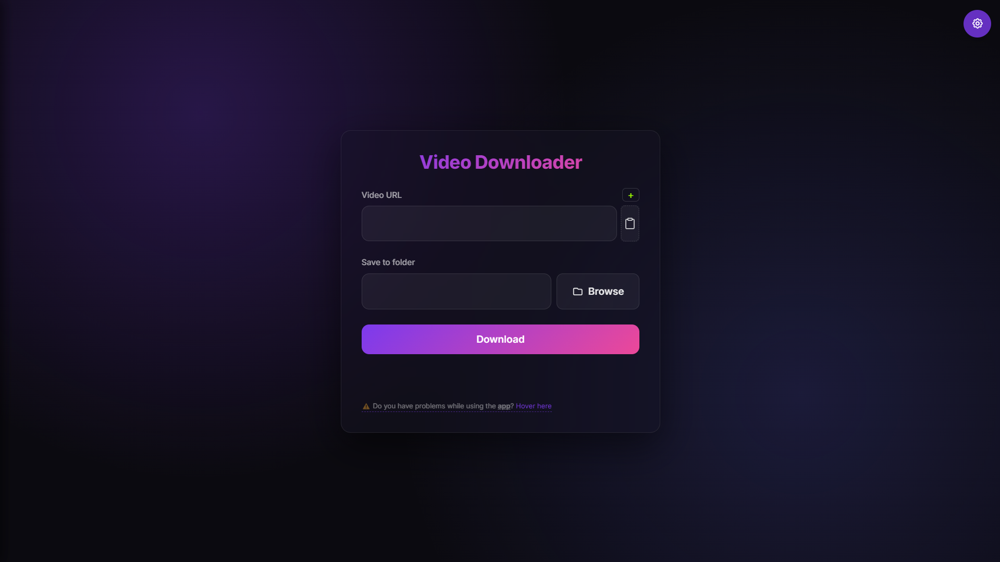

<div align="center">


# 🎬 Video Downloader

**Download videos. Generate subtitles. Read AI summaries. All locally.**


</div>

---

## ✨ Features

| Feature | Description |
|---|---|
| ⬇️ **Downloading** | YouTube & more via yt-dlp, multi-URL queue with auto-retry |
| 🔐 **Cookie Support** | Access private/age-restricted videos via Firefox, Chrome, Edge, Opera |
| 🎙️ **Subtitles** | Auto-generation via faster-whisper (Base / Small / Turbo / Medium) |
| 🤖 **AI Conspect** | Local LLM (Ollama) generates summaries with timecodes |
| 🎞️ **Built-in Player** | PiP, position saving, multiple themes |
| 📄 **PDF Export** | Export your AI conspect to PDF in one click |
| 🔒 **100% Local** | No cloud, no API keys, no tracking |

---

## 📸 Screenshots



> _More screenshots coming with the stable release :)_

<!-- TODO: add demo.gif -->

---

## 📦 Downloads

| File | Description | Size |
|---|---|---|
| **`setup-packed.zip`** | **Recommended** — Full installer with setup wizard | ~906 MB |
| **`setup-unpacked.zip`** | Portable — Just extract and run, no installation | ~1010 MB |
| **`video_downloader.zip`** | Source code with all dependencies | ~1080 MB |

---

## 🚀 Installation

### Option 1: Installer (Recommended)

1. Download **`setup-packed.zip`**
2. Extract the archive
3. Run **`Video Downloader Setup 1.0.0.exe`**
4. Follow the installation wizard
5. Launch from Start Menu or Desktop shortcut

### Option 2: Portable

1. Download **`setup-unpacked.zip`**
2. Extract to any folder
3. Run **`Video Downloader.exe`** — no installation needed

### Option 3: From Source
```bash
# 1. Clone the repository
git clone https://github.com/your-username/video-downloader.git
cd video-downloader

# 2. Install Node dependencies
npm install

# 3. Install Python dependencies
pip install flask faster-whisper yt-dlp

# 4. Run the app
npm start
```

> ⚠️ On first launch, the Flask server starts automatically on port `5000`.

### For AI Summaries (optional)
```bash
# Install Ollama — https://ollama.ai/download

# Pull recommended model (works on 4GB VRAM)
ollama pull gemma3:4b
```

---

## 🎯 How to Use

1. **Launch the application**
2. **Paste a video URL** (YouTube, Vimeo, etc.)
3. **Select save location** (optional — defaults to Videos folder)
4. **Click Download**
5. **Watch the real-time progress bar**

Your video will be saved in MP4 format at the best available quality.

---

## 🏗️ Architecture
```
┌─────────────────────────────────┐
│         Electron (UI)           │
│  index.html / index.js / CSS    │
│  IPC → preload.js               │
└──────────────┬──────────────────┘
               │ HTTP (localhost:5000)
┌──────────────▼──────────────────┐
│       Python Flask Backend      │
│  app.py          yt-dlp         │
│  subtitle_generator.py          │
│  faster-whisper  ffmpeg         │
│  Ollama (local LLM inference)   │
└─────────────────────────────────┘
```

- **Electron** — renders UI and manages windows
- **Flask** — handles downloading, transcription & LLM requests
- **yt-dlp** — extracts video from hundreds of platforms
- **faster-whisper** — local transcription via Whisper
- **Ollama** — local inference, recommended model `gemma3:4b`

---

## ⚙️ System Requirements

| Component | Minimum | Recommended |
|---|---|---|
| OS | Windows 10 x64 | Windows 11 x64 |
| RAM | 4 GB | 8 GB |
| GPU VRAM | — | 4 GB (Turbo/Medium Whisper + Ollama) |
| Disk | 5 GB | 10 GB |
| Internet | Required | Required |

---

## 🔒 Privacy & Security

- ✅ **No telemetry** — your data stays on your device
- ✅ **Local processing** — all downloads happen on your machine
- ✅ **Open source** — inspect the code yourself
- ✅ **No ads** — clean, distraction-free experience

---

## 🗺️ Roadmap

- [x] Multi-URL download queue
- [x] Browser cookie support (Firefox, Chrome, Edge, Opera)
- [x] Subtitle generation with SSE progress streaming
- [x] AI conspect with timecodes + PDF export
- [x] Built-in player (PiP, themes, position memory)
- [ ] Rezka / KinoGo support
- [ ] cinemahd-deaf.org HLS streaming support
- [ ] Auto-updater

---

## 🐛 Known Issues

- Backend console window may remain open after closing the app *(fix in progress)*
- Some protected content may require browser cookies to be available

---

## 📝 Changelog

### v1.0.0 — Initial Release *(January 22, 2026)*

- ✨ Initial public release
- 🎬 YouTube downloading with best quality selection
- 🔐 Browser cookie integration for private videos
- 🎨 Modern, user-friendly interface
- 📂 Custom download location selection
- 🔄 Support for multiple consecutive downloads

---

## 🙏 Acknowledgments

- [yt-dlp](https://github.com/yt-dlp/yt-dlp) — powerful video downloader
- [FFmpeg](https://ffmpeg.org/) — video processing
- [Electron](https://www.electronjs.org/) — cross-platform framework
- [Flask](https://flask.palletsprojects.com/) — Python web framework
- [faster-whisper](https://github.com/SYSTRAN/faster-whisper) — local transcription
- [Ollama](https://ollama.ai) — local LLM inference

---

## 📜 License

ISC © 2026

---

<div align="center">
  <sub>Made with ❤️ by NiceTryJony · If you like this project, give it a ⭐</sub>
  <br>
  <sub>Built with ☕ and ffmpeg-induced suffering</sub>
</div>
